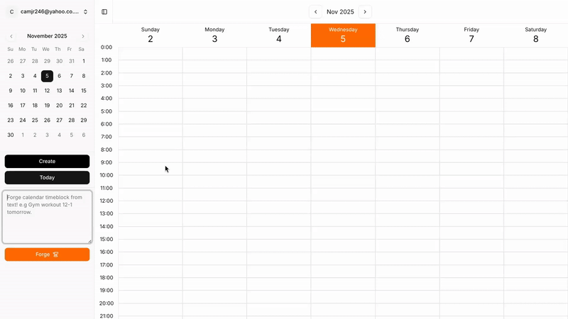

# ⚒️ Forge Calendar
[Live Demo](https://forge-gyctcjcxbrc5a8ap.ukwest-01.azurewebsites.net/)

## Description
Working as a bartender my shift patterns can vary quite a lot week to week, this makes it hard to have a standard blocked out week with weekly recurring events for managing my tasks. 
Having to create every event at the start of the week manually with standard user interfaces feels very tedious and taxing. This lead me to the idea of describing my events with a natural
language prompt instead and having an LLM create calendar events out this prompt. This reduces the friction for me creating events and allows me to plan my week more easily and achieve my goals.

## Features
✅  User authentication  
✅  Simple calendar event crud interface  
✅  LLM powered event creation  
⏳ Multiple events from a single prompt  
⏳ Editing/Deleting current events with event prompting  
⏳ Support for multiple LLM providers  
⏳ Google Calendar Sync  

## Technologies Used
- React
- ASP.NET
- PostgreSQL
- OpenAI API
- Azure

Given the interactive nature of a calendar application I felt it was important to use react as a frontend framework as I wanted the experience to feel native like and smooth, there was also
good libraies like tanstack query for handling updating calendar events and shadcn components for a proffessional look. For the backend I went with ASP.NET as I wanted to learn more about the
framework and C# as a language, I found that I really enjoyed developing with this as it felt like it had enough batteries included to make development quick and easy but allowed me to organise 
my code as I saw fit with the minimal API's style. I went with OpenAI for my llm integration as I use it day to day and found the developer playground good for prototyping, in the future I 
may test with other llms to see if speed or accuracy is improved. Deployment on azure was quick and easy with great integration of ASP.NET web apps and their PostgreSQL database hosting, this 
was definetely the smoothest deployment out of any I have done.
